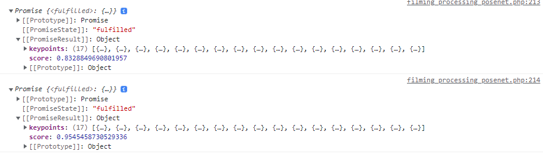

# img_pose_estimation_pangpang
Web JS posenet&amp;movenet image keypoint detection and skeleton drawing

# example
<h3>Change the action of the form</h3>

<h3>Insert image from host web</h3>

<h3>Posenet Result</h3>

<h3>Movenet Result</h3>

# need
none

# what coding
Coding everything except posenet.js

# Production period
2022 10 26 ~ 2022 11 08
